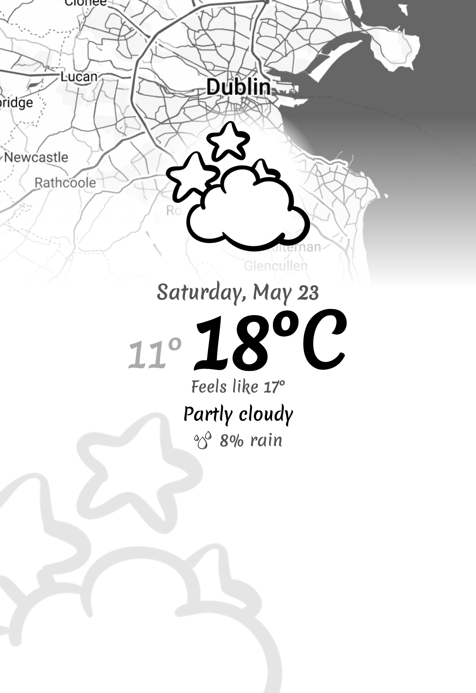
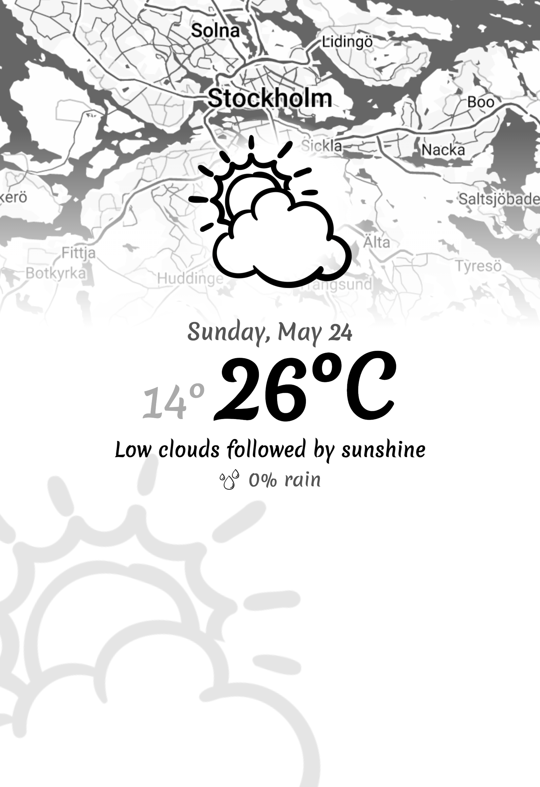
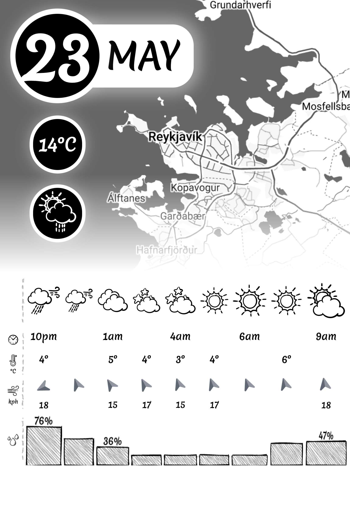
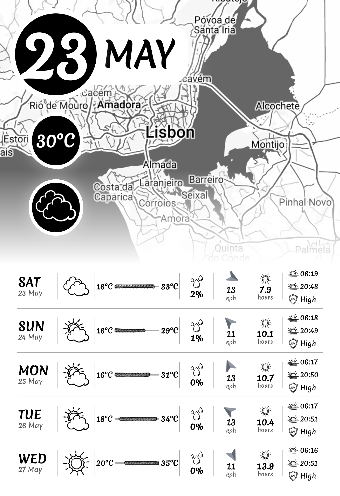

# Inkplate 10 Weather Calendar

[](https://github.com/chrisjtwomey/inkplate10-weather-cal/actions/workflows/build.yaml)
[](https://github.com/chrisjtwomey/inkplate10-weather-cal/actions/workflows/release.yaml)


Display weather forecasts and a stylised map of your city on an Inkplate 10 that can last for months on a single battery. Four page layouts are available: a simplified today/tomorrow view, an hourly forecast table, and a 5-day daily summary.

> **Using a different e-paper display?** The firmware is built around a hardware-agnostic [`IBoard`](include/IBoard.h) interface. See [doc/custom-board.md](doc/custom-board.md) to integrate your own device.


<table align="center">
  <tr>
    <td align="center"><br/><sub>Today view: Current weather, map, and summary for Dublin</sub></td>
    <td align="center"><br/><sub>Tomorrow view: Forecast for Stockholm with icon and phrase</sub></td>
  </tr>
  <tr>
    <td align="center"><br/><sub>Hourly view: 9-hour forecast table for Reykjavik</sub></td>
    <td align="center"><br/><sub>Daily view: 5-day summary for Lisbon with icons and highs/lows</sub></td>
  </tr>
</table>

- [Getting Started](#getting-started)
- [Documentation](#documentation)
- [Background](#background)
- [How it Works](#how-it-works)
- [Bill of Materials](#bill-of-materials)
- [Client Configuration](#client-configuration)
- [Firmware](#firmware)
- [License](#license)

## Documentation

- Server guide: [server/README.md](server/README.md)
- Weather provider API setup: [doc/weather-apis.md](doc/weather-apis.md)
- Google Static Maps setup: [doc/google-static-maps.md](doc/google-static-maps.md)
- **Integrating a custom board** — implement the `IBoard` interface to use any e-paper device: [doc/custom-board.md](doc/custom-board.md)
- Contributor guide: [CONTRIBUTING.md](CONTRIBUTING.md)


## Getting Started

This project has two main parts: a **server** (image generator) and a **client** (firmware for the Inkplate 10). Follow these steps to get up and running.

### Prepare your server configuration

For API keys, environment variables, schedule configuration, and advanced server setup, see [server/README.md](server/README.md).

Before starting the server, copy the example config and fill in your API keys, Google Maps Map ID, and location:

```sh
cp server/config.example.yaml server/config.yaml
# Edit server/config.yaml and set your weather API key, Google Maps API key, map ID, and location
```


### 1. Server Setup

You can run the server using Docker (recommended) or directly with Python. The server generates weather/calendar images and serves them to the Inkplate client.

**Run with Docker Compose (Recommended)**

A sample `docker-compose.yml` is included in the repository. Most configuration is done in `server/config.yaml`, which is volume-mounted into the container. Only `LOCATION` and `SERVER_PORT` are set as environment variables (and are optional overrides):

```yaml
version: '3'
services:
  weather-cal-server:
    image: ghcr.io/chrisjtwomey/inkplate10-weather-cal-server:latest
    restart: unless-stopped
    ports:
      - "8080:8080"
    # Recommended: mount your config.yaml for server configuration
    volumes:
      - ./server/config.yaml:/app/server/config.yaml:ro
    # Only override these if needed
    environment:
      LOCATION: "Dublin, IE"   # Optional: override location
      SERVER_PORT: "8080"      # Optional: override port
```

Then start the server:

```sh
docker compose up -d
```

**Run with Docker (single command)**

```sh
docker run -d --restart unless-stopped \
  -p 8080:8080 \
  -e WEATHER_SERVICE=accuweather \
  -e WEATHER_APIKEY=<your_key> \
  -e GOOGLE_APIKEY=<your_key> \
  -e GOOGLE_STATICMAPS_MAPID=<your_map_id> \
  -e LOCATION="Dublin, IE" \
  -e SERVER_TIMEZONE="Europe/Dublin" \
  ghcr.io/chrisjtwomey/inkplate10-weather-cal-server:latest
```


**Run from Source**

See [server/README.md](server/README.md).

### 2. Client (Firmware) Setup

Pre-built firmware binaries in the [releases](https://github.com/chrisjtwomey/inkplate10-weather-cal/releases) are SD-card firmware only.

**Recommended path (pre-built firmware):**

1. Place a `config.yaml` in the root of your SD card (see [doc/config.yaml](doc/config.yaml) for an example).
2. Download `firmware.bin` from the [latest release](https://github.com/chrisjtwomey/inkplate10-weather-cal/releases/latest).
3. Flash it using `esptool.py`:

```sh
pip install esptool
esptool.py --chip esp32 --port /dev/ttyUSB0 write_flash 0x10000 firmware.bin
```

4. Insert the SD card and boot the device. The firmware reads `config.yaml` from SD card on startup.

**No SD card setup:**

If you want firmware configured via `src/defaults.cpp` (no SD card), build from source instead. See [CONTRIBUTING.md](CONTRIBUTING.md).

**Notes:**

- SD card support is intended for SolderedElectronics Inkplate 10 hardware.
- Older E-Radionica Inkplate 10 boards can have [higher deep-sleep drain](https://github.com/chrisjtwomey/inkplate10-weather-cal/blob/main/doc/power-consumption.md#update-june-28-2023) when SD card is enabled.
- Using a different e-paper device? See [doc/custom-board.md](doc/custom-board.md) for how to implement the `IBoard` interface and swap it in.

## Background

Back in late 2021, I came across a project called [MagInkCal](https://github.com/speedyg0nz/MagInkCal) that uses a Raspberry Pi Zero WH to retrieve events from a Google calendar and display them on an e-ink display. One of the drawbacks of the project however is power consumption and I thought of porting the project over to use the ESP32 platform instead. What resulted eventually was this project, though I decided to focus on more of a weather station aspect rather than Google calendar events.

I recommend taking a look at the author's other project [MagInkDash](https://github.com/speedyg0nz/MagInkDash) which has a similar architecture to this.

## How it Works

Both a server and client are required. The main workload is in the server which allows the client to save power by not generating the image itself.


### Client (Inkplate 10)
1. Wakes from deep sleep and attempts to connect to WiFi.
2. Attempts to get current network time and update real-time clock.
3. (Optional) Attempts to connect to an [MQTT](server/README.md#mqtt) topic to publish logs. This allows you to see what the ESP32 is doing without needing to monitor the serial connection.
4. Downloads the PNG image the server is hosting.
5. (Optional, SD card only) Writes the downloaded PNG image to SD card.
6. Reads the PNG image and writes it to the e-ink display.
7. Returns to deep sleep for the number of seconds the server dictated via `X-Next-Refresh-Seconds`. If the server doesn't provide a value, backs off exponentially (2 min → 6 min → … → 24 h) until it does.

#### Features:
  - Ultra-low power consumption:
    - approx 24µA in deep sleep
    - approx 120mA awake
    - approx 10-20 seconds awake time daily
    - **1 - 2 years+** of battery life using a 2000mAh cell.
  - Real-time clock for precise sleep/wake times.
  - Daylight savings time (DST) handled entirely server-side — the server sends seconds-until-next-refresh so the client never needs to reason about timezones for scheduling.
  - Can publish to a MQTT topic for remote logging.
  - Renders messages on the e-ink display for critical errors (battery low, WiFi timeout, etc.). The previous calendar image stays visible behind the banner (cached in SPIFFS on first successful refresh).
  - Exponential back-off on server failures: 2 min → 6 min → 18 min → … → 24 h cap, resetting on the next successful server-dictated refresh.
  - Optional: SD card support for loading client config from `config.yaml` without reflashing (see [doc/config.yaml](doc/config.yaml)).

#### Power Consumption

See [doc/power-consumption.md](doc/power-consumption.md) for details on power consumption and battery performance.

### Server
See [server/README.md](server/README.md) for full server documentation.

## Bill of Materials

- **Inkplate 10 by Soldered Electronics ~€150**

  The [Inkplate 10](https://www.crowdsupply.com/soldered/inkplate-10) is an all-in-one hardware solution. It has a 9.7" 1200x825 display with integrated ESP32, real-time clock, and battery power management. You can get it [directly from Soldered Electronics](https://soldered.com/product/soldered-inkplate-10-9-7-e-paper-board-with-enclosure-copy) or from a [UK reseller like Pimoroni](https://shop.pimoroni.com/products/inkplate-10-9-7-e-paper-display?variant=39959293591635).

- **Optional: 2 GB microSD card ~€5**

  **Note: SD card support is disabled by default. Use build flag `USE_SDCARD` to enable.**

  Only needed if you want to load client config (`config.yaml`) from the card without reflashing. Image caching for error banners is handled automatically via internal SPIFFS flash.

- **3000mAh LiPo battery pack ~€10**

  Any Lithium-Ion/Polymer battery with a JST connector. Some Inkplate 10s are sold with a 3000mAh battery (~1-2+ years of life). See [doc/power-consumption.md](doc/power-consumption.md) for real-world numbers.

- **CR2032 3V coin cell ~€1**

  Powers the real-time clock during deep sleep.

- **A server to run the image generator**

  Anything that can run Docker or Python 3.10+. A Raspberry Pi Zero 2W is a good low-power option; any always-on computer works.

- **Black photo frame 8"x10" ~€10**

  The mount needs to fit an 8"x10" frame but expose only the e-ink area (~5.5"x7.5").

## Client Configuration

The client (Inkplate 10) configuration can be loaded from `config.yaml` on the SD card root when firmware provided in the [latest release](https://github.com/chrisjtwomey/inkplate10-weather-cal/releases/latest). Use [doc/config.yaml](doc/config.yaml) as the starting template.

There is on-firmware defaults in `src/defaults.cpp`. These are are compiled into the binary. Any missing keys from `config.yaml` will fall back to the firmware defaults.

If you are not using an SD Card to configure the client, see [Choose your configuration mode](./CONTRIBUTING.md#choose-your-configuration-mode) for how to build firmware to only use `defaults.cpp`.

### Parameters

| Key | Type | Default (firmware) | What it does |
|---|---|---|---|
| `server.url` | string | `http://YOUR_SERVER_HOST:8080/calendar.png` | Initial image URL to fetch (`/today.png`, `/tomorrow.png`, `/hourly.png`, `/daily.png`). |
| `server.retries` | integer | `3` | Number of retry attempts for image download and draw operations. |
| `server.default_refresh_seconds` | integer | `3600` | Fallback sleep interval in seconds when the server has not provided `X-Next-Refresh-Seconds`. |
| `wifi.ssid` | string | `XXXX` | WiFi SSID used by the client. |
| `wifi.pass` | string | `XXXX` | WiFi password used by the client. |
| `wifi.retries` | integer | `10` | Number of WiFi connection attempts before timeout. |
| `ntp.host` | string | `pool.ntp.org` | NTP server host for RTC synchronization. |
| `ntp.timezone` | string (IANA timezone) | `Europe/Dublin` | Local timezone used for client-side timestamps/logging. |
| `mqtt_logger.enabled` | boolean | `false` | Enables client [MQTT](server/README.md#mqtt) logging. |
| `mqtt_logger.broker` | string | `localhost` | MQTT broker host for client log publishing. |
| `mqtt_logger.port` | integer | `1883` | MQTT broker port. |
| `mqtt_logger.clientId` | string | `inkplate10-weather-client` | MQTT client ID used by the device. |
| `mqtt_logger.topic` | string | `mqtt/eink-cal-client` | MQTT topic used for client log publishing. |
| `mqtt_logger.retries` | integer | `3` | Number of MQTT connection retries before timeout. |

### Example

```yaml
server:
  url: http://YOUR_SERVER_HOST:8080/today.png
  retries: 3
wifi:
  ssid: YOUR_WIFI
  pass: YOUR_WIFI_PASSWORD
  retries: 6
ntp:
  host: pool.ntp.org
  timezone: Europe/Dublin
mqtt_logger:
  enabled: false
  broker: localhost
  port: 1883
  clientId: inkplate10-weather-calendar
  topic: mqtt/inkplate10-weather-calendar
  retries: 3
```

For a fully annotated example, see [doc/config.yaml](doc/config.yaml).


## License

All code in this repository is licensed under the MIT license.

Weather icons by [lutfix](https://www.flaticon.com/authors/lutfix) from [www.flaticon.com](https://www.flaticon.com).
